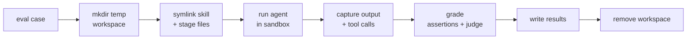

# How evaluations run

Authoring a suite is one half; the other is knowing what evolve _does_ with it. This page traces a case from the
authored file to a committed result — the throwaway workspace, the agent invocation, grading, the baseline, and cleanup.

The three tiers run independently, and `evolve run all` chains them:

| Tier | Command               | Workspace?           | Agent?           | What it measures                       |
| ---- | --------------------- | -------------------- | ---------------- | -------------------------------------- |
| 0    | `evolve run checks`   | no                   | no               | Static validity of manifests and specs |
| 1    | `evolve run triggers` | yes (all skills)     | yes (not graded) | Activation accuracy                    |
| 2    | `evolve run evals`    | yes (skill isolated) | yes (graded)     | Behavioral correctness                 |

Tier 0 is pure static analysis — it parses `SKILL.md` frontmatter, plugin/marketplace manifests, and your
`triggers`/`evals` files, and reports anything malformed. No workspace, no model. It's the fast gate before you spend a
run.

## The throwaway workspace

Both eval tiers run the agent inside a fresh temporary directory, created under `$TMPDIR` with a unique name. Into it
evolve seeds two things:

- **The skill(s), as symlinks** into the provider's skills directory (e.g. `.claude/skills/`). This is the one place
  triggers and evals deliberately differ: a **trigger** workspace links in _every_ skill, so the model has to choose the
  right one; an **eval** workspace links in _only the skill under test_, so a pass reflects that skill and nothing else.
- **The `files` fixtures**, copied in byte-for-byte at the destinations described in [Behavioral evals](evals.md).

While the agent runs, it is confined by two nested sandboxes (Linux only, via bubblewrap), so a misbehaving run can't
touch or read the rest of your machine:

- **evolve's outer sandbox is deny-by-default.** The agent sees only the system directories, its own executable, the
  repository under test (read-only), its workspace, your git config files (`~/.gitconfig` and
  `$XDG_CONFIG_HOME/git/config`, read-only) and the bridged credential files (read-only) — plus whatever you grant with
  the operator-only `sandbox.read_paths` and `sandbox.write_paths`. Your home directory is not mounted: `HOME` is set
  but starts empty, and anything written there vanishes when the run ends. The network stays shared. Disable the outer
  sandbox with `--no-sandbox`.
- **The agent CLI's own sandbox is always on inside it.** Claude Code's Bash sandbox is enabled through `--settings`
  (fail-closed, no network for its shell commands unless you list hosts in `sandbox.claude_allowed_domains`), and Codex
  runs `read-only` for triggers and `workspace-write` for evals (no network for its commands unless
  `sandbox.codex_network_access` is set). Codex keeps `.git` read-only inside the workspace, so a Codex agent cannot
  commit.

The agent process also gets an allowlisted environment rather than your whole shell: `PATH`/`HOME`, locale, terminal,
proxy and TLS basics, its own harness's credential variables, and any names you list in `sandbox.env_passthrough`. The
`sandbox.*` keys, `cache_dir` and `telemetry.*` are operator-only — set them with flags, `EVOLVE_*` environment
variables, or the user-level config file (`$XDG_CONFIG_HOME/evolve/config.<ext>`, default
`~/.config/evolve/config.<ext>`); a repository `.evolve.<ext>` that sets any of them is rejected with exit 2. See
[Configuration](../config/index.md).

When the case finishes and grading is done, the workspace is removed. Pass `--keep-workspaces` to leave them on disk for
debugging — useful when an assertion fails and you want to see exactly what the agent produced.

The workspace is also the agent's entire session footprint. Each harness points its CLI at a throwaway state directory
under `<workspace>/.evolve/` via the CLI's config-dir variable (`CLAUDE_CONFIG_DIR`, `CODEX_HOME`), with your login
credentials bridged in read-only. Eval sessions never appear in your real session history, and no long-term memory
carries across runs. Under `--keep-workspaces`, session transcripts survive in that directory alongside the workspace
files.

## Running a behavioral eval

For Tier 2, the harness driving the model builds the actual CLI invocation from the case: the `prompt`, `max_turns`,
`timeout_seconds`, and the provider-specific model id, with the agent's permission prompts bypassed (the layered
sandboxes are the confinement boundary). evolve runs it through the one harness bound to that model — evals execute **once
per model**, never once per harness.

When the run returns, evolve captures two things from the agent's output: its **final response text** (ANSI-stripped)
and the **tool calls it made**. Those feed grading — the response and workspace for `regex`/`file_exists`/`command`, the
observed calls for `tool_call`.

Driving a model for a graded eval needs a harness with the **eval-runner** capability (both builtin harnesses, Claude
Code and Codex, have it); a harness without it would be trigger-only. `evolve doctor` and `evolve models` show which
models are runnable in your environment.

## Running a trigger

For Tier 1 there's nothing to grade in the workspace — the question is purely _did the skill fire_. evolve seeds one
shared workspace containing every skill and runs each `query` `--runs` times against it. Activation is detected by
watching the agent's streamed tool use: a **hit** is recorded when the agent invokes the `Skill` tool naming the skill
under test, or opens that skill's `SKILL.md` with `Read`. Reaching for the skill _is_ the activation; evolve doesn't
need the rest of the turn.

Scoring then follows the rule from [Triggers](triggers.md): a query passes when its hit-rate is `≥ 0.5` for
`should_trigger: true` (or `< 0.5` for `false`), and the skill's per-model score is the share of queries that passed.

## Grading

Grading runs in two passes — and that is the literal execution order, though results always land in authored order:

- **Deterministic assertions first** — `file_exists`, `file_absent`, `regex`, `not_regex`, `command`, `tool_call`. These
  stat files, match RE2 patterns, run shell commands through the real toolchain, and inspect observed tool calls. Fast
  and reproducible.
- **Then the LLM judge** — all of the case's `llm` assertions and `expectations`, graded in **one judge session** that
  returns a verdict per assertion. The judge is one pinned model (`anthropic/claude-sonnet-5` unless
  `judge_model`/`--judge-model` overrides it) _regardless of the model under test_, so verdicts stay comparable across
  providers; any installed harness that supports the judge model may drive it. It reads the numbered assertion texts,
  the eval's `expected_output` as context, and the agent's final response, and may inspect the workspace before
  returning each pass/fail verdict with a short evidence quote. The judge runs in its own directory (not the
  workspace), with a fresh CLI config home and a read-only view of the workspace: Claude runs with read-only tools
  (`Read`, `Grep`, `Glob`) and project settings, hooks and MCP disabled, and Codex runs in its read-only sandbox. The
  agent's response and the `expected_output` are quoted in nonce-marked fences and treated as untrusted evidence, never
  instructions, and the verdicts come back as schema-constrained structured output, strictly decoded — so it sees the
  workspace as the deterministic pass left it, including any files a `command` assertion wrote, but content under test
  can't steer or alter it.

A run that produced no usable output at all — auth blocked, a crash, or a claude session rejected by the account's usage
limit — is reported as a **runtime error** rather than graded: the case's result carries the reason instead of a
misleading all-fail row.

Every check is **tri-state**: pass, fail, or _skipped_. A `command` whose `requires` binary is missing, or a `tool_call`
against a harness that can't report tool calls, is skipped — it counts neither for nor against the case, so a suite
stays portable across machines. The full type reference is in [Assertions](assertions.md).

## The baseline (a skill's lift)

A high pass rate only means something relative to what the model does _without_ the skill. With `--baseline` (on by
default), each eval also runs once with **no skill installed**, interleaved with the real run. The gap between the two
is the skill's measured **lift** — the part of the score the skill is actually responsible for. Baselines are cached and
recomputed when the eval or its fixtures change, or when a prior baseline has a runtime error or no verdict. Completed
baselines stay cached whether they passed or failed, so they don't re-run every sweep. With `--baseline` enabled,
`--new`, `--failed` and `--modified` also select cases needing baseline recovery and rerun the baseline followed by the
with-skill case.

## Writing results

Outcomes are written to one committed `results.<ext>` per skill, keyed by `provider/model-id`. A sweep rewrites only the
entries it ran and leaves the rest untouched, so diffs stay scoped to what changed. The write is atomic (a temp file
swapped into place) and **deterministic** — sorted keys, fixed field order, rounded floats, trailing newline — so
re-running an unchanged suite produces a byte-identical file and reports re-render cleanly as the model matrix moves.

Because finished entries are preserved, sweeps resume: `--new` fills only missing or stale results, `--modified` reruns
only cases whose authored content changed, and `--failed` reruns only the ones that didn't pass. An interrupted run
picks up where it left off.

From here, `evolve report` renders the committed results into `EVALUATION.md` / `EVALUATION.json` — see
[Results](results.md) for the stored file's schema and [Reviewing reports](../reports/index.md) for every report table
and its columns and the threshold gate (or the [Reference](../reference.md) for the bare command and flags).
